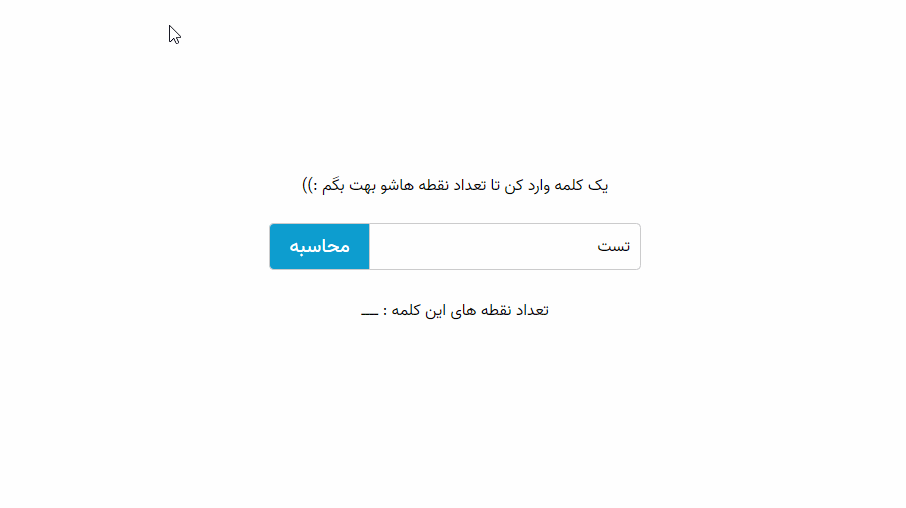

# Text Dots Counter

**Description: **We want to count number of `.` inside characters. for example `i` have one dot, and `p` not have a dot.

Support English, Persian, and Arabic languages

I attended in a Front-end challenge, and this was one of project task.

